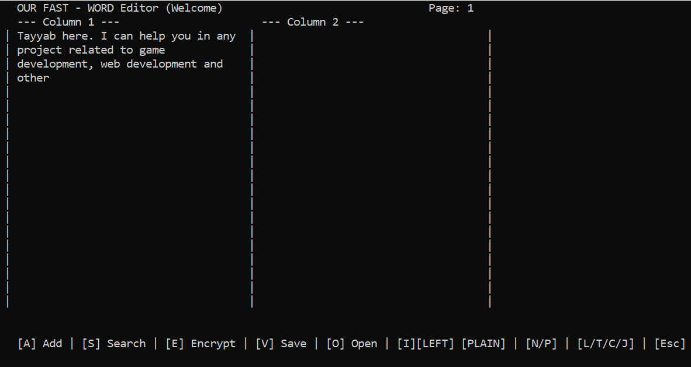

# 📘 TwinColumn Console Document Editor

A **terminal-based two-column document editor** with smart layout, undo/redo, search highlighting, and **multi-layer bitwise encryption** — built for **legacy Windows systems**.

---

## Overview

**TwinColumn Console Document Editor** is a fully interactive, console-based text editor designed for legacy Windows environments where GUI support is unavailable.

Using only **`windows.h`** and **`conio.h`**, the editor provides a professional publishing workflow inside the terminal — including:

- Two-column magazine-style layouts  
- Word-aware wrapping  
- Undo/redo system  
- Search highlighting with history  
- Automatic table of contents  
- A custom **multi-layer encryption system implemented strictly with bitwise operations**

---

## Main Editor Interface

---

## Core Features

### 📰 Two-Column Page Layout
- Fixed-width and fixed-height pages  
- Exactly two side-by-side columns  
- Smart word wrapping (no broken words)  
- Automatic column balancing for visual symmetry  

### ⏪ Undo / Redo System
- Minimum **10-level undo/redo per page**  
- Fixed-size stack-based history  
- Instant visual feedback  

### 🔍 Search & Highlight with History
- Case-insensitive search  
- Live highlighting inside the document  
- Stores last **5 search terms** with match counts  
- Clean visual feedback without reloading the editor  

### 📐 Text Alignment Modes
Applies to newly inserted paragraphs:
- Left  
- Right  
- Center  
- Justified  

➡️ Current alignment is always visible in the **status bar**.

---

## Multi-Layer Bitwise Encryption

A **custom-designed encryption engine** implemented using **only bitwise operations**  
(**no modulo, multiplication, or division**).

### Encryption Layers

**1. Dynamic Key Generation**
- Depends on document length, text position, and user seed  
- Uses XOR, bit shifts, and rotations  

**2. Bit Shuffling**
- Swaps and XORs internal bits of each byte  

**3. Block Cipher Mixing**
- Encrypts in **8-byte blocks**  
- Each byte depends on adjacent bytes  

**4. Checksum Verification**
- Detects tampering or incorrect keys  
- Bitwise-only integrity check  

✔ Auto-detects encrypted vs plain text  
✔ Safe failure on incorrect decryption  

---

## 📑 Automatic Table of Contents
- Generated from heading lines (`# Heading`)  
- Displays:
  - Title  
  - Page number  
  - Column number  

Ideal for **books, reports, and long manuscripts**.

---

## Search and History Feature

---

## ⌨️ Keyboard Controls

| Key | Action |
|---|---|
| A | Add paragraph |
| N / P | Next / Previous page |
| U / R | Undo / Redo |
| S | Search & highlight |
| L / T / C / J | Left / Right / Center / Justify |
| E | Encrypt / Decrypt |
| V | Save document |
| O | Open document |
| I | Table of Contents |
| ESC | Exit editor |

---

## 🛠️ Technical Details

- **Language:** C++  
- **Platform:** Windows Console  
- **Libraries Used:**
  - `windows.h`
  - `conio.h`

### Architecture
- Doubly linked list for pages  
- Fixed-size undo/redo stacks  
- Bitwise-only encryption engine  

### Design Goals
- No GUI dependencies  
- Immediate user feedback  
- Secure document handling  

---

## 🚀 Build & Run Instructions

1. Open the project in **Visual Studio (Windows)**  
2. Ensure **Console Subsystem** is selected  
3. Build the project (Debug or Release)  
4. Run in terminal  

⚠️ **Windows-only** due to `windows.h` and `conio.h`

---

## 👤 Author

**Muhammad Tayyab**  
Computer Science Student  
C++ | Systems Programming | Console Applications

